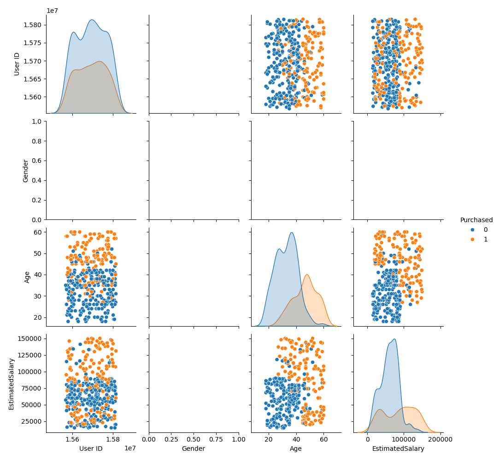
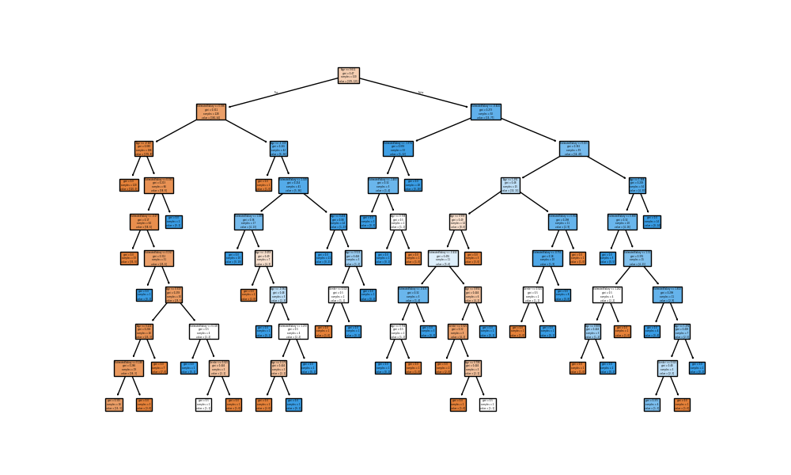
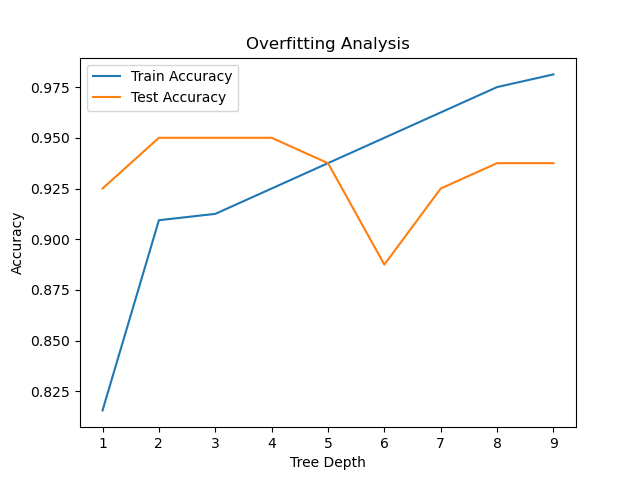
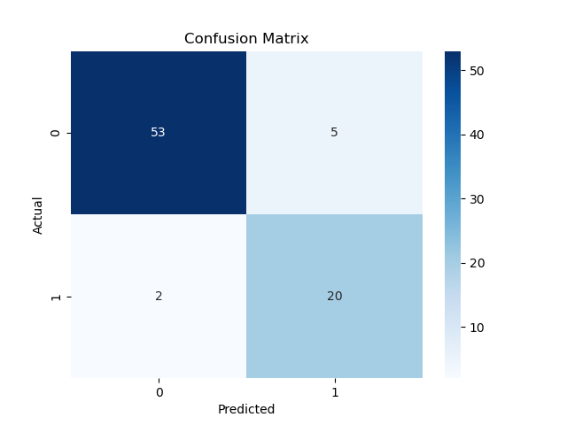
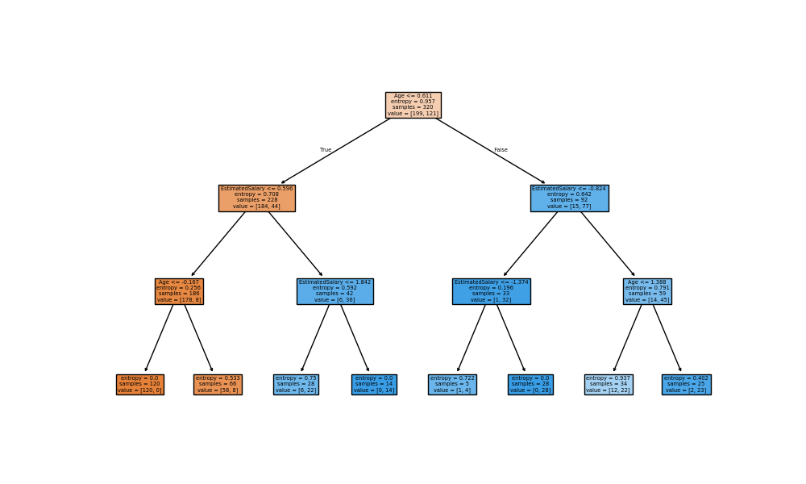
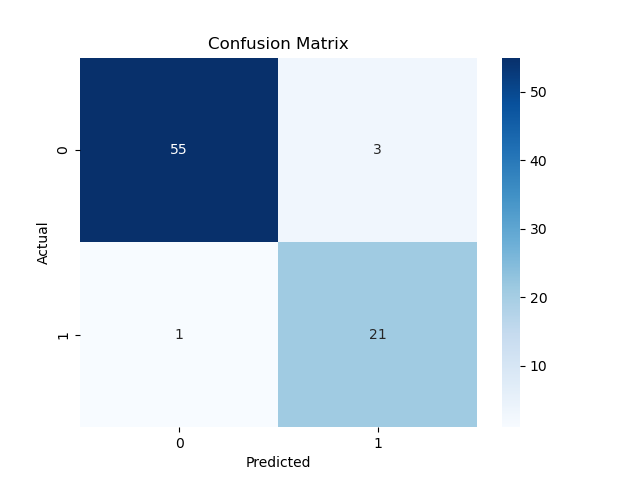
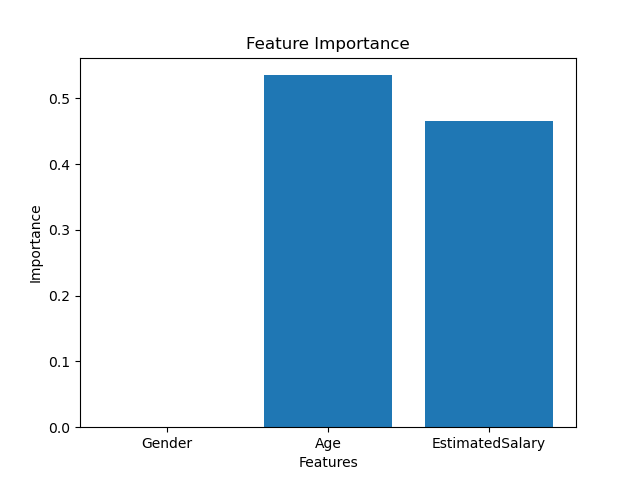

# 🚗 Customer Purchase Prediction using Decision Tree

Customer Purchase Prediction is a key application of supervised machine learning. Using the **Decision Tree Classification** algorithm, companies can predict whether a customer will purchase a product based on demographic features, enabling better marketing strategies and targeted advertisements.

---

## 📌 Table of Contents

- [Overview](#overview)
- [What is Customer Purchase Prediction?](#what-is-customer-purchase-prediction)
- [What is the Decision Tree Algorithm?](#what-is-the-decision-tree-algorithm)
- [Dataset](#dataset)
- [Project Structure](#project-structure)
- [Steps for Implementation](#steps-for-implementation)
- [Model Training & Tuning](#model-training--tuning)
- [Results](#results)
- [Technologies Used](#technologies-used)
- [How to Run](#how-to-run)

---

## Overview

In this machine learning project, we use the **Decision Tree Classification algorithm** to predict whether a customer will purchase a product based on features like **Gender**,**Age** and **Estimated Salary**.

The project includes:
- Data preprocessing  
- Feature scaling  
- Model training  
- Overfitting analysis  
- Hyperparameter tuning  

---

## What is Customer Purchase Prediction?

Customer Purchase Prediction is the process of analyzing customer data to determine whether a person is likely to buy a product.

Businesses use this to:
- Target potential customers  
- Improve marketing strategies  
- Increase conversion rates  
- Reduce unnecessary advertising costs  

---

## What is the Decision Tree Algorithm?

A **Decision Tree** is a supervised machine learning algorithm used for classification and regression tasks.

### How Decision Tree Works:
1. Select the best feature using metrics like **Entropy** or **Gini Index**
2. Split the dataset into subsets based on feature values
3. Repeat the process recursively to create branches
4. Stop when a leaf node (final decision) is reached

### Key Points:
- Easy to understand and interpret  
- Works for both linear and non-linear data  
- Prone to **overfitting** if not controlled  

---

## Dataset

The dataset (`Customer_Data.csv`) contains customer information.

- **Features Used:**
  - `Age`
  - `EstimatedSalary`
  -  `Gender`
- **Target Variable:**
  - `Purchased` (0 = No, 1 = Yes)

✔ No missing values  
✔ No categorical encoding required  

---
## Project Workflow

1. Import libraries  
2. Load dataset  
3. Preprocess data  
4. Train-test split  
5. Feature scaling  
6. Train Decision Tree  
7. Evaluate model  
8. Hyperparameter tuning  
9. Final prediction  

---

## 💻 Complete Code


## 1. IMPORT LIBRARIES

```python
import numpy as np
import pandas as pd
import matplotlib.pyplot as plt
import seaborn as sns

from sklearn.tree import DecisionTreeClassifier
from sklearn.model_selection import train_test_split, GridSearchCV
from sklearn.preprocessing import StandardScaler
from sklearn.metrics import confusion_matrix, classification_report, accuracy_score
```
---


## 2. LOAD DATASET

```python
df = pd.read_csv("Customer_Data.csv")
```
---
---


## 3. Exploitary data analysis

### 3.1 Pairplot - Feature Relationships



**Insight:**
- Clear separation between Purchased and Not Purchased
- Age and Estimated Salary show strong influence
- Some overlap exists → model needs non-linear boundary

---
---

## 4. FEATURE SELECTION

```python
X = data_set.drop(['Purchased','User ID'],axis=1)
y = data_set['Purchased']
```
---


## 5. TRAIN TEST SPLIT

```python
from sklearn.model_selection import train_test_split
X_train,X_test,y_train,y_test = train_test_split(X,y,test_size = 0.2,random_state = 0)
```
---


## 6. FEATURE SCALING

```python
scaler = StandardScaler()

X_train_sc = scaler.fit_transform(X_train)
X_test_sc = scaler.transform(X_test)
```
---


## 7. TRAIN MODEL

```python
model = DecisionTreeClassifier()
model.fit(X_train_sc,y_train)
```
---

### 7.1 Decision Tree 



**Insight:**
- The model mainly uses Estimated Salary and Age to make decisions
- The tree is deep and complex, indicating possible overfitting
- It captures non-linear patterns, but may not generalize well to new dataSome overlap exists → model needs non-linear boundary

### 7.2 Depth Vs Accuracy 



**Insight:**
- As tree depth increases, training accuracy keeps increasing, showing the model is learning more details
- Test accuracy peaks around depth 3–5, indicating the best performance
- After that, test accuracy drops, which shows overfitting
---


## 8. EVALUATION
## 📊 Model Evaluation

### 8.1 Accuracy
- **Training Accuracy:** 100%
- **Test Accuracy:** 91%

👉 The model performs well but shows slight **overfitting** (perfect training accuracy).

---

### 8.2 Confusion Matrix


- Correct predictions:
  - **53** (class 0)
  - **20** (class 1)
- Misclassifications:
  - **5 false positives**
  - **2 false negatives**

👉 The model makes very few errors and performs reliably on both classes.

---

### 8.3 Classification Report

- **Precision (class 0):** 0.96 → very accurate for non-purchased customers  
- **Recall (class 1):** 0.91 → good at identifying actual buyers  
- **F1-score:** ~0.91 → balanced performance  

---

### 8.4 Conclusion

- The model achieves **strong overall performance (91% accuracy)**  
- Slight **overfitting** is present but not severe  
- Performs slightly better for **class 0 than class 1**
---


## 9. HYPERPARAMETER TUNING
```python
params = {
    'max_depth': [2,3,4,5],
    'min_samples_split': [2,5,10],
    'min_samples_leaf': [1,2,5]
}

grid = GridSearchCV(
    DecisionTreeClassifier(random_state=0),
    param_grid,
    cv=5,
    scoring='accuracy'
)

grid.fit(X_train, y_train)

best_model = grid.best_estimator_
```
---


## 10. FINAL MODEL

```python
y_pred_final = best_model.predict(X_test)

print("\nFinal Accuracy:", accuracy_score(y_test, y_pred_final))
```
---


## 11. VISUALIZATION
### 11.1 Decision Tree 



**Insight:**
- The model first splits on Age, showing it is the most important factor
- Estimated Salary is used in the next splits, refining the prediction
- The tree is simpler and more balanced, indicating better generalization
- ### 11.2 Confusion Matrix


- Correct predictions:
  - **55** (class 0)
  - **21** (class 1)
- Misclassifications:
  - **3 false positives**
  - **1 false negative**

👉 The model shows improved performance with fewer errors and better accuracy across both classes.
---


## 12. FEATURE IMPORTANCE
### 12.1 Feature Importance



- **Age is the most important feature** in predicting customer purchases.  
- **Estimated Salary also plays a significant role** in the decision.  
- **Gender has almost no impact** on the model.  

👉 The model mainly relies on **Age and Estimated Salary** for making predictions.
